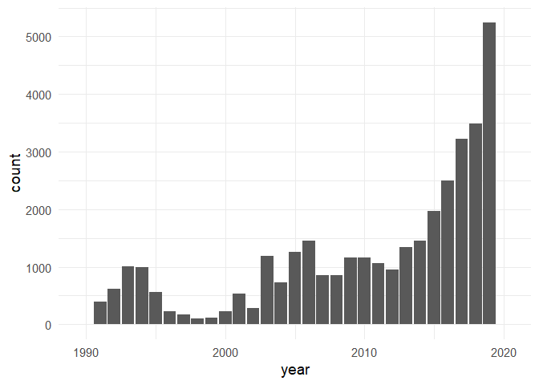
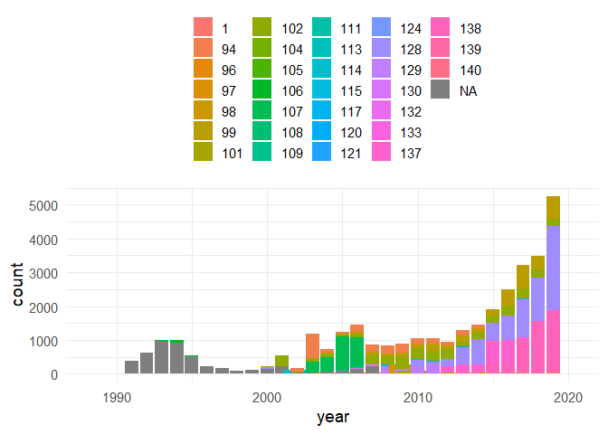
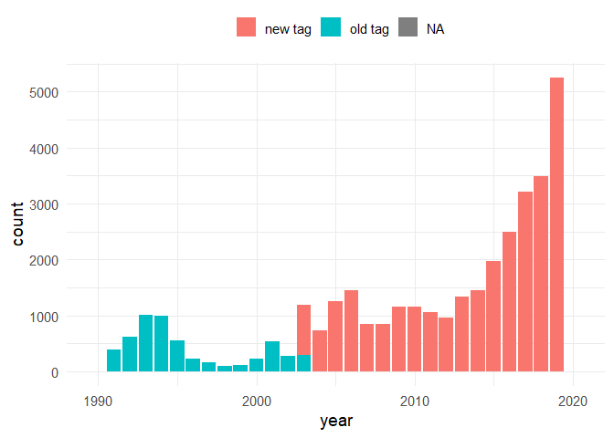
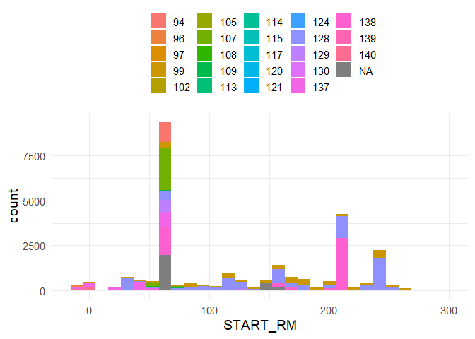
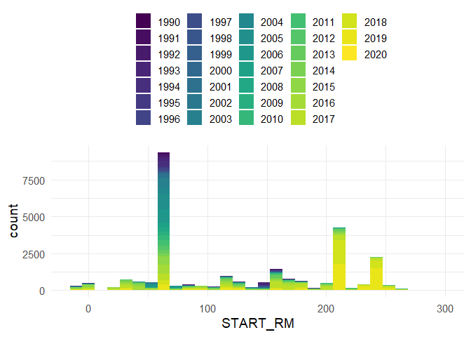
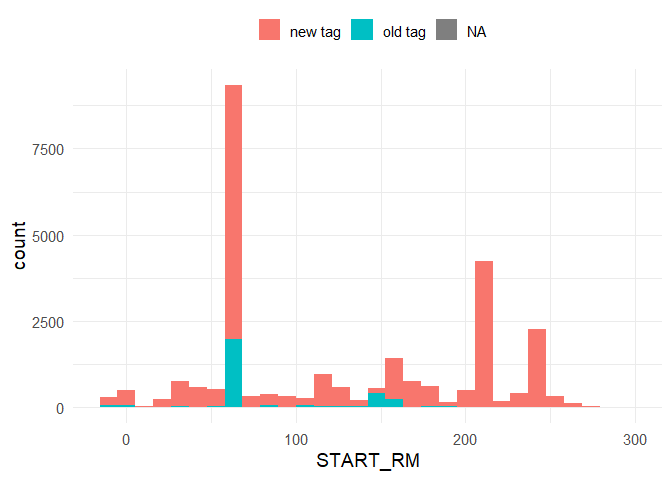

Exploratory analysis - sample size
================
Jan K Boyer
March 4, 2020

``` r
# summaries of sample size of PIT tagged flannelmouth sucker, grouped
# by year, river, project, tag type, gear type, etc.
# use to inform decisions about what data we want to use in model
#Author: Jan Boyer, AGFD, jboyer@azgfd.gov
#Inputs: ./data/all_PIT_tagged_flannelmouth.csv
#Outputs: none
#Dependencies: none

require(tidyverse)
```

    ## Loading required package: tidyverse

    ## -- Attaching packages ---------------------------------------------- tidyverse 1.2.1 --

    ## v ggplot2 3.2.0     v purrr   0.3.2
    ## v tibble  2.1.3     v dplyr   0.8.3
    ## v tidyr   1.0.0     v stringr 1.4.0
    ## v readr   1.3.1     v forcats 0.4.0

    ## -- Conflicts ------------------------------------------------- tidyverse_conflicts() --
    ## x dplyr::filter() masks stats::filter()
    ## x dplyr::lag()    masks stats::lag()

``` r
theme_set(theme_minimal(base_size = 14)) #prettier plot defaults


#load data
fms <- read.csv("./data/all_PIT_tagged_flannelmouth.csv", stringsAsFactors = FALSE)
colnames(fms)
```

    ##  [1] "SAMPLE_TYPE"        "TRIP_ID"            "GEAR_CODE"         
    ##  [4] "START_DATETIME"     "RIVER_CODE"         "START_RM"          
    ##  [7] "END_RM"             "START_RKM"          "END_RKM"           
    ## [10] "GPS_START_WAYPOINT" "GPS_END_WAYPOINT"   "GIS_X"             
    ## [13] "GIS_Y"              "LAT"                "LON"               
    ## [16] "TOTAL_LENGTH"       "FORK_LENGTH"        "WEIGHT"            
    ## [19] "PITTAG"             "PITTAG_RECAP"       "DISPOSITION_CODE"  
    ## [22] "year"               "TL"                 "FL"

``` r
#classify each fish as a recapture (multiple records) or not (only seen once)
n_captures <- fms %>%
  group_by(PITTAG) %>%
  summarize(n_captures = n(),
            recapture = case_when(n_captures > 1 ~ "Y",
                                  n_captures == 1 ~ "N"))

fms <- fms %>%
  left_join(n_captures)
```

    ## Joining, by = "PITTAG"

``` r
# classify tags as old or new
#old tags have 10 characters, new tags have 14
#any other number is a typo, or a tag missing some characters
fms <- fms %>%
  mutate(tag_length = nchar(PITTAG),
         tag_type = case_when(tag_length == 10 ~ "old tag",
                              tag_length == 14 ~ "new tag")) %>%
  select(-tag_length)

#NEED TO FIX: about 20 new tags missing . (3DD003BFCE6CD)
#             go back to load file and correct

#subset to recaptured fish only
fms <- fms %>%
  filter(recapture == "Y")

# missing data ############

#How many records are missing river mile data
missing.rm <- fms %>%
  filter(is.na(START_RM))

missing.rm %>%
  group_by(RIVER_CODE) %>%
  summarize(n = n())
```

    ## # A tibble: 6 x 2
    ##   RIVER_CODE     n
    ##   <chr>      <int>
    ## 1 COR          366
    ## 2 HAV           27
    ## 3 LCR         7809
    ## 4 PAR           13
    ## 5 SHI            6
    ## 6 <NA>           1

``` r
#only 366 in mainstem
#LCR records are ok because they probably have a kilometer

#how many records are missing length data
missing.length <- fms %>%
  filter(is.na(TL))

missing.length %>%
  group_by(RIVER_CODE) %>%
  summarize(n = n())
```

    ## # A tibble: 2 x 2
    ##   RIVER_CODE     n
    ##   <chr>      <int>
    ## 1 COR           25
    ## 2 LCR            7

``` r
#good, only 25 don't have length data

# summaries - n fish by tributary, year, type of tag, gear, project, etc. ######

#how many old tags vs. new tags
fms %>%
  group_by(tag_type) %>%
  summarize(n = n())
```

    ## # A tibble: 3 x 2
    ##   tag_type     n
    ##   <chr>    <int>
    ## 1 new tag  29597
    ## 2 old tag   5550
    ## 3 <NA>         4

``` r
#how many in each river
fms %>%
  group_by(RIVER_CODE) %>%
  summarize(n = n()) %>%
  arrange(-n)
```

    ## # A tibble: 7 x 2
    ##   RIVER_CODE     n
    ##   <chr>      <int>
    ## 1 COR        27179
    ## 2 LCR         7881
    ## 3 HAV           60
    ## 4 PAR           13
    ## 5 SHI            7
    ## 6 KAN            6
    ## 7 <NA>           5

``` r
fms %>% #by year
  group_by(year) %>%
  summarise(n = n()) %>%
  print(n = Inf)
```

    ## # A tibble: 32 x 2
    ##     year     n
    ##    <int> <int>
    ##  1  1990     2
    ##  2  1991   391
    ##  3  1992   623
    ##  4  1993  1008
    ##  5  1994   990
    ##  6  1995   559
    ##  7  1996   232
    ##  8  1997   166
    ##  9  1998   100
    ## 10  1999   116
    ## 11  2000   232
    ## 12  2001   536
    ## 13  2002   286
    ## 14  2003  1190
    ## 15  2004   728
    ## 16  2005  1261
    ## 17  2006  1448
    ## 18  2007   856
    ## 19  2008   857
    ## 20  2009  1166
    ## 21  2010  1155
    ## 22  2011  1060
    ## 23  2012   957
    ## 24  2013  1345
    ## 25  2014  1451
    ## 26  2015  1966
    ## 27  2016  2502
    ## 28  2017  3220
    ## 29  2018  3490
    ## 30  2019  5248
    ## 31  2020     3
    ## 32    NA     7

``` r
fms %>% #plot, by year
  ggplot(aes(x = year)) +
  geom_bar()
```



``` r
fms %>% #plot, by year and project
  ggplot(aes(x = year, fill = factor(SAMPLE_TYPE))) +
  theme(legend.position = "top", legend.title = element_blank()) +
  geom_bar()
```



``` r
fms %>% #plot, by year and tag type
  ggplot(aes(x = year, fill = tag_type)) +
  theme(legend.position = "top", legend.title = element_blank()) +
  geom_bar()
```



``` r
#by project
fms %>%
  group_by(SAMPLE_TYPE) %>%
  summarise(n = n()) %>%
  arrange(-n) %>%
  print(n = Inf)
```

    ## # A tibble: 32 x 2
    ##    SAMPLE_TYPE     n
    ##          <int> <int>
    ##  1         128  7974
    ##  2          NA  4990
    ##  3         138  4935
    ##  4         102  3987
    ##  5          99  3594
    ##  6         107  2615
    ##  7          94  2593
    ##  8         137  1916
    ##  9         129   779
    ## 10          98   346
    ## 11         139   205
    ## 12         140   176
    ## 13         114   170
    ## 14         115   142
    ## 15         101   128
    ## 16         130   125
    ## 17         106   116
    ## 18          96   100
    ## 19         109    70
    ## 20         108    64
    ## 21          97    39
    ## 22         124    30
    ## 23         120    24
    ## 24         132    14
    ## 25         117     5
    ## 26           1     3
    ## 27         113     3
    ## 28         111     2
    ## 29         121     2
    ## 30         133     2
    ## 31         104     1
    ## 32         105     1

``` r
#by gear type
fms %>%
  group_by(GEAR_CODE) %>%
  summarise(n = n()) %>%
  arrange(-n) %>%
  print(n = Inf)
```

    ## # A tibble: 44 x 2
    ##    GEAR_CODE     n
    ##    <chr>     <int>
    ##  1 EL        10645
    ##  2 HB         7214
    ##  3 HS         7053
    ##  4 GFH        2599
    ##  5 MHB        1617
    ##  6 AHP        1436
    ##  7 TK         1086
    ##  8 TRA         970
    ##  9 TL          642
    ## 10 HMB         443
    ## 11 HN          252
    ## 12 HW          225
    ## 13 MH          200
    ## 14 TN          140
    ## 15 SEN          78
    ## 16 T75          78
    ## 17 TM           71
    ## 18 MHS          51
    ## 19 SS           51
    ## 20 BL           46
    ## 21 GM           42
    ## 22 HL           39
    ## 23 <NA>         35
    ## 24 GP           32
    ## 25 BS           16
    ## 26 BP           11
    ## 27 BX            9
    ## 28 HM            9
    ## 29 SA            8
    ## 30 AN            6
    ## 31 TP            6
    ## 32 GX            5
    ## 33 HM2           5
    ## 34 SC            5
    ## 35 SX            5
    ## 36 MT            4
    ## 37 GF            3
    ## 38 SG            3
    ## 39 TK75          3
    ## 40 DH            2
    ## 41 TS            2
    ## 42 TY            2
    ## 43 DIP           1
    ## 44 SL            1

``` r
#by river mile (Colorado only, excludes tributaries)
fms %>%
  filter(RIVER_CODE == "COR") %>%
  ggplot(aes(x = START_RM, fill = factor(SAMPLE_TYPE))) +
  theme(legend.position = "top", legend.title = element_blank()) +
  geom_histogram()
```

    ## `stat_bin()` using `bins = 30`. Pick better value with `binwidth`.



``` r
#obviously lots more sampling effort at LCR, JCM-west, and bridge city
#USFWS aggregation (128) and AGFD (99) have most even catch geographically

fms %>%
  filter(RIVER_CODE == "COR") %>%
  ggplot(aes(x = START_RM, fill = factor(year))) +
  scale_fill_viridis_d() +
  theme(legend.position = "top", legend.title = element_blank()) +
  geom_histogram()
```

    ## `stat_bin()` using `bins = 30`. Pick better value with `binwidth`.



``` r
#western canyon data mostly from recent years
#most older data is near LCR or RM 150
#what is at RM 150?
#subsetting to recent years would be a good way to ensure more even sampling
#geographically, avoid excessive LCR sampling from skewing results

fms %>%
  filter(RIVER_CODE == "COR") %>%
  ggplot(aes(x = START_RM, fill = tag_type)) +
  theme(legend.position = "top", legend.title = element_blank()) +
  geom_histogram()
```

    ## `stat_bin()` using `bins = 30`. Pick better value with `binwidth`.


